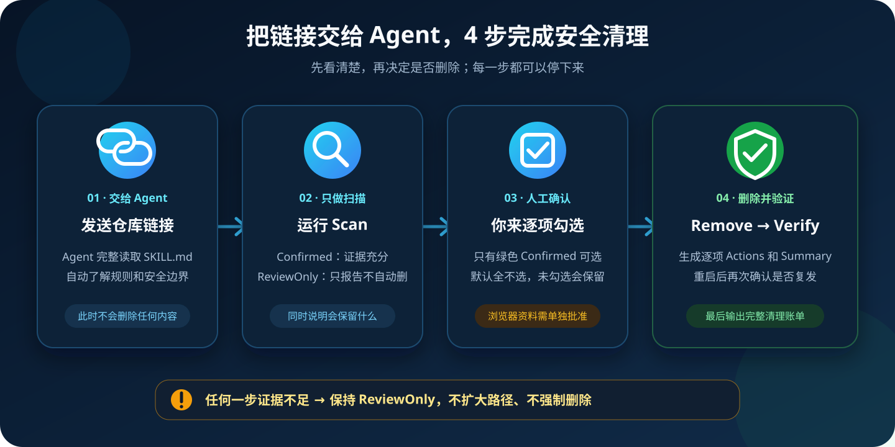
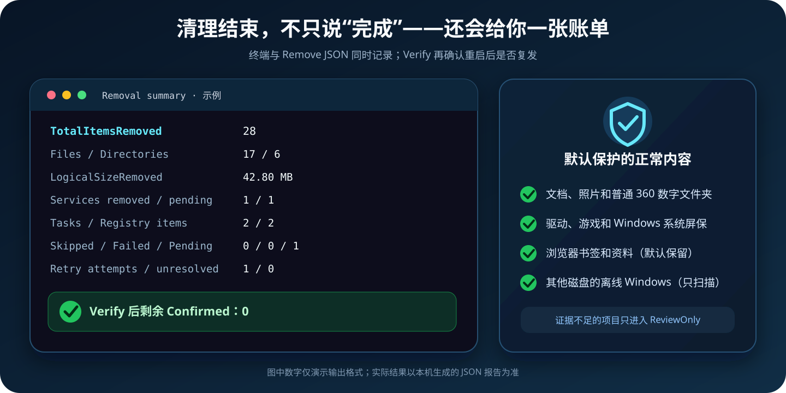

<p align="center">
  <strong>简体中文</strong> · <a href="README.en.md">English</a>
</p>

<p align="center">
  
</p>

<h1 align="center">Windows 360 Cleaner Skill</h1>

<p align="center">
  给 Codex、豆包和其他 AI Agent 使用的 Windows 360/Qihoo 软件安全清理技能包<br>
  <strong>先扫描 · 人工确认 · 精确删除 · 重启验证 · 输出清理账单</strong>
</p>

<p align="center">
  <a href="https://github.com/LongXL6/windows-360-cleaner/actions/workflows/validate.yml"></a>
  
  
  
  <a href="LICENSE"></a>
</p>

> [!IMPORTANT]
> 这是一个让 **AI Agent 读取并执行的 Skill 技能包**，不是一个需要小白研究按钮的独立清理软件。`scripts/` 中的 PowerShell 是技能包调用的确定性执行资源。

## 30 秒开始：复制下面整段给 Agent

```text
请把 https://github.com/LongXL6/windows-360-cleaner 当作一个 Skill 技能包使用，而不是普通清理工具。
请先完整读取仓库根目录的 SKILL.md，并遵守其中所有安全边界；需要判断可疑目标时再读取 references。
第一步只运行 Scan，不要删除，向我分别解释 Confirmed、ReviewOnly、会保留的正常文件和浏览器资料。
只有在我看完扫描结果并明确批准后，才能执行 Remove；不要扩大允许路径，不要跨离线 Windows 系统删除。
删除后先读取 Remove JSON 报告中的 Summary；然后运行 Verify，并从 Verify JSON 报告的 Findings 统计最终剩余的 Confirmed 数。
最终请清楚输出：总共删除的对象数、文件数、目录数、清除文件的逻辑大小、服务已删除/待重启删除数、计划任务数、注册表键/值数、停止的进程数、跳过/失败/待处理数、重试次数、未解决目标数、Verify 后剩余 Confirmed 数。即使某项为 0 也要写出来；不要把文件逻辑大小误称为实际释放的磁盘空间。
```

## 豆包用户：复制下面整段

豆包支持在对话中上传文件，但不同版本或模式能否直接操作本机 PowerShell 可能不同。下面的提示词要求它先检查自身能力，不能把“给出命令”说成“已经执行”。

```text
请把 https://github.com/LongXL6/windows-360-cleaner 当作一个 AI 技能包使用。
请先读取仓库根目录的 SKILL.md；不要只看 README，也不要根据文件名搜索并强删所有含 360 的内容。
开始前先明确告诉我：你当前是否真的能够读取这个仓库、访问这台 Windows 电脑的本机 PowerShell，并运行命令。
如果可以操作终端，第一步只能运行 Scan。解释 Confirmed、ReviewOnly 和会保留的正常文件后停止，等待我明确批准；未经批准绝对不能运行 Remove。
如果不能操作终端，不要声称已经扫描或删除。请让我下载仓库 ZIP，双击 scripts\Scan-360.cmd，再把生成的 JSON 报告上传给你解释。之后仍须等待我的明确批准，才能指导我双击 Remove-360.cmd，并把同一份已审阅报告拖入窗口。
完成删除后必须运行 Verify，并按照 SKILL.md 的 Required final output 列出所有清理统计，即使某项为 0 也要写出来。
```

更详细的两种操作路线、上传报告时的隐私提醒和故障处理见 [豆包与通用 Agent 使用指南](references/doubao.md)。

> [!WARNING]
> 不要使用“搜索所有名字含 `360` 的文件然后强删”这种方法。数字 360 可能出现在照片、游戏地图、模型、哈希值和 Windows 文件中。本技能只处理“**精确允许路径 + 本机产品证据**”同时成立的目标。

## 它解决什么问题

| 找出真正来源 | 保护正常文件 | 给出可核验结果 |
|---|---|---|
| 识别 360 安全产品、浏览器、软件管家、画报/多绘屏保及其下载链 | 普通数字文件、驱动、游戏、系统屏保和浏览器资料默认不动 | 每个动作写入 JSON，最后汇总删除数量、失败项和剩余项 |

## 工作原理

<p align="center">
  
</p>

核心规则只有一句：**Agent 可以自动扫描和解释，但不能替你批准永久删除。**

## 清理结束会得到什么

<p align="center">
  
</p>

Remove 报告中的 `Summary` 会记录：

- 删除的总对象、文件、目录和文件逻辑大小。
- 已删除和仍待 Windows 重启后删除的服务数。
- 已复核删除的计划任务、注册表键和注册表值数量。
- 停止的目标进程，以及跳过、失败、待处理、重试和最终未解决的数量。
- 获批数量、当前仍可处理的交集，以及批准后新增、消失或不再确认的数量。
- 完全删除、部分清理和无法安全测量的路径数量。

文件大小来自删除前后的安全快照差值，并对父子目标去重。硬链接、稀疏文件和压缩文件可能让“文件逻辑大小”与“磁盘实际新增可用空间”不同，所以本项目不会把两者混为一谈。重启后的最终结果以 Verify 报告的 `Findings` 为准。

## 为什么它更适合小白

| 防呆保护 | 实际行为 |
|---|---|
| 先扫描后删除 | `Scan` 只读；`Remove` 需要已审阅的 Scan JSON、开关、精确确认短语和管理员授权 |
| 证据不足不强删 | 可疑目标进入 `ReviewOnly`，不会自动升级为可删除项 |
| 拒绝宽泛路径 | 磁盘根目录、Windows、用户目录、整个 Temp 等路径永远不会成为删除目标 |
| 防止目录逃逸 | 目标、父路径或子树出现 junction/符号链接时整批失败关闭 |
| 浏览器资料单独保护 | 书签、历史记录和会话默认保留；删除需要第二组明确批准 |
| 不乱杀正常软件 | 普通应用仅仅加载了目标 DLL 时不会被强停，默认要求重启后复查 |
| 不跨系统乱删 | 其他磁盘上的离线 Windows 永远只有扫描模式 |
| 报告不覆盖文件 | JSON 只能新建，拒绝覆盖已有报告或伪装成其他扩展名 |
| 默认脱敏 | 报告不写入电脑名和 Windows 用户名 |

## 它会检查什么

- 360 安全卫士、杀毒、浏览器、极速浏览器、软件管家等安装目录和卸载记录。
- `dhpingbao`、`duohuipingbao`、`huabao_tmp`、`360hb_tmp` 等画报/屏保组件。
- `SoftMgrUpdate*` 计划任务和有证据支持的第三方工具箱下载链。
- 指向已确认目标的启动项、服务和正在运行的进程。
- Explorer 加载的 `qcnethelp64.dll`、`xhqcnethelp64.dll`、`SoftMgrExt64.dll` 等锁定模块。
- 用户指定的其他 Windows 磁盘；这些结果始终只报告、不跨系统删除。

## 它默认不会删除什么

- 仅仅名字中含有数字 `360` 的文件或文件夹。
- Windows 自带屏保，例如 `Bubbles.scr`、`PhotoScreensaver.scr`、`scrnsave.scr`。
- 驱动精灵、显卡/网卡驱动、游戏目录和 Steam/iRacing 数字资源。
- `winToolBox` 中独立的 `kantu`、`clear`、`pdf`、`zip` 工具，除非用户单独批准。
- `360se6\User Data`、`360Chrome\Chrome\User Data`、`360ChromeX\Chrome\User Data` 和旧版 `360browser` 中的浏览器个人资料；程序目录会单独检测。
- 其他 Windows 安装中的任何文件。

## 安装为 Codex Skill

将整个仓库复制到：

```text
%USERPROFILE%\.codex\skills\windows-360-cleaner
```

然后在 Codex 中说：

```text
$windows-360-cleaner 帮我先扫描这台电脑上的 360 全家桶，不要直接删除。
```

Agent 应先读取 [SKILL.md](SKILL.md)。只有需要判断检测证据时才读取 [检测目录](references/detection-catalog.md)，遇到锁文件时才读取 [疑难排查](references/troubleshooting.md)。

豆包和其他不支持 `$skill-name` 安装方式的 Agent 不需要修改技能名称：直接给它仓库链接，并要求先读取 `SKILL.md`。如果 Agent 无法运行本机命令，使用上面的手动 Scan 路线。

<details>
<summary><strong>不使用 Agent：双击脚本的备用方法</strong></summary>

### 1. 先扫描

1. 点击 GitHub 页面右上角绿色的 **Code**。
2. 点击 **Download ZIP** 并解压。
3. 双击 `scripts\Scan-360.cmd`。
4. 查看桌面生成的 JSON 报告和窗口里的扫描结果。

扫描不会删除任何东西，也不需要管理员权限。

### 2. 确认后删除

1. 关闭正在运行的 360 软件和浏览器。
2. 双击 `scripts\Remove-360.cmd`。
3. 阅读警告并按 `Y`。
4. 再输入 `REMOVE-360`。
5. 把刚才已审阅的 Scan JSON 拖入窗口，按回车。
6. Windows 弹出管理员授权窗口时点击“是”。
7. 在原窗口查看删除动作、汇总和剩余项，完成后重启 Windows 一次。

删除是永久操作，不会进入回收站。Scan JSON 是精确批准清单：提权后新出现但未在报告中获批的目标只会报告，不会删除。输入错误、直接回车或按 `N` 都会安全退出并返回非成功状态。

### 3. 重启后验证

双击 `scripts\Verify-360.cmd`。如果没有 `Confirmed`，说明已确认的组件没有重新出现。

</details>

<details>
<summary><strong>PowerShell 命令和高级选项</strong></summary>

```powershell
# 只扫描
.\scripts\Invoke-360Cleanup.ps1 -Mode Scan

# 删除已确认目标：需要已审阅的 Scan 报告、管理员权限、开关和精确确认短语
.\scripts\Invoke-360Cleanup.ps1 -Mode Remove -ApprovedReport 'C:\path\to\approved-scan.json' `
  -ConfirmRemoval -ConfirmationPhrase REMOVE-CONFIRMED-360

# 高风险可选项：先用同一选项生成 Scan 报告，备份并单独审阅浏览器资料
.\scripts\Invoke-360Cleanup.ps1 -Mode Scan -IncludeBrowserProfiles

# 再使用上一步实际生成且已审阅的报告执行删除
.\scripts\Invoke-360Cleanup.ps1 -Mode Remove -ApprovedReport 'C:\path\to\approved-scan.json' `
  -ConfirmRemoval -ConfirmationPhrase REMOVE-CONFIRMED-360 `
  -IncludeBrowserProfiles -BrowserProfileConfirmation DELETE-360-BROWSER-DATA

# 删除后验证
.\scripts\Invoke-360Cleanup.ps1 -Mode Verify

# 扫描另一块磁盘上的 Windows，绝不自动删除
.\scripts\Invoke-360Cleanup.ps1 -Mode Scan -OfflineWindowsRoot F:\
```

`-AllowExplorerRestart` 和 `-ForceLockedTargets` 是高级故障处理选项，不在小白流程中启用。Agent 必须先解释精确目标和风险，再重新获得批准。

</details>

<details>
<summary><strong>WinToolBox 是谁家的，为什么会与 360 组件一起出现</strong></summary>

`WinToolBox` 不是微软或 Windows 官方软件，也不是 360 官方产品。我们在真实机器上确认其主程序、看图、清理和 PDF 组件由 **北京奥蓝德信息科技有限公司**签名；服务名带有 `huajun`，与华军软件园体系相符。

同一个工具箱目录可能混入由**北京奇虎科技有限公司**签名的 `KitTip.dll`、`cssdk.dll`，后者产品信息为 `360.cn / 统计组件`。我们还遇到过其 `SoftMgr` 子目录包含 360 安全卫士组件并参与下载多绘屏保。

因此本项目将它描述为：**奥蓝德/华军系第三方工具箱；当本机存在奇虎签名 DLL、360 SoftMgr、自动下载任务或多绘屏保链路时，按 PUP/捆绑推广载体处理，而不是误称为 360 官方 WinToolBox。**

数字签名只能证明发布者身份，不代表软件行为一定符合用户意愿。公开入口：[奥蓝德](https://www.softbutler.cn/) · [华军软件园](https://www.onlinedown.net/contact.html)

</details>

<details>
<summary><strong>为什么多绘屏保会“删了又回来”</strong></summary>

我们遇到过的真实链路是：

```text
奥蓝德/华军系 winToolBox 更新服务
  → 含 360 组件的 SoftMgrUpdate* 计划任务
  → Temp\duohuipingbao\360hb_tmp\huabaosetup.exe
  → AppData\Local\dhpingbao\duohuipingbao.exe
  → Explorer 加载 qcnethelp / SoftMgrExt DLL
```

如果只删除最终屏保目录，不删除有证据支持的下载服务和更新任务，它就可能重新出现。本技能会先找下载来源，再处理持久化，最后验证；普通软件仅仅加载了目标 DLL 时不会被强停。

</details>

## 验证技能包本身

下面的测试只会在系统临时目录创建并删除隔离夹具，不会对真实 360 软件执行 Remove：

```powershell
.\scripts\Test-360Cleaner.ps1
```

它会验证：

- PowerShell 5.1 编码和语法。
- 报告防覆盖、双重确认与取消退出码。
- 普通 `360` 用户文件、浏览器书签和 WinToolBox 保留目录不受影响。
- 伪造 marker、junction 外部 canary、锁文件和离线 Windows 失败关闭。
- 重复运行归零、嵌套目标不重复统计、目标数量上限和 JSON Summary。

GitHub Actions 在每次提交后运行同一套测试。

## 技能包结构

```text
windows-360-cleaner/
├── SKILL.md                    # Agent 的入口与安全规则
├── agents/openai.yaml          # Codex 展示信息
├── scripts/                    # Scan / Remove / Verify 与隔离测试
├── references/                 # 检测证据、豆包指南和疑难排查
├── assets/readme/              # README 原创教学图片与微信二维码
├── README.en.md                # English guide
└── README.md                   # 中文默认首页
```

## 安全说明

- 重要电脑建议先建立系统还原点并备份浏览器资料。
- 不要从不可信转载站下载修改版脚本。
- 本项目无法保证覆盖每个历史版本、地区版本或未来变体。
- 正常软件若进入 `ReviewOnly`，不要手工强删；请提交 Issue，并附脱敏后的路径、文件版本和签名信息。
- “PUP/潜在不受欢迎软件”是行为与用户同意层面的分类，不等于在法律上宣称其为病毒或木马。

## 联系作者

遇到无法判断的 `ReviewOnly` 项目，优先提交公开的 [GitHub Issue](https://github.com/LongXL6/windows-360-cleaner/issues)，这样解决方案也能帮助其他用户。需要通过微信联系作者时，可以点击或扫描下面的二维码。

<p align="center">
  <a href="assets/readme/wechat-longxl.jpg">
    
  </a>
</p>

> [!NOTE]
> 微信是个人联系渠道，不提供付费远程控制，也不要向任何人发送密码、验证码或未脱敏的私人文件。项目问题仍建议优先使用 GitHub Issue。

## License

[MIT](LICENSE)
