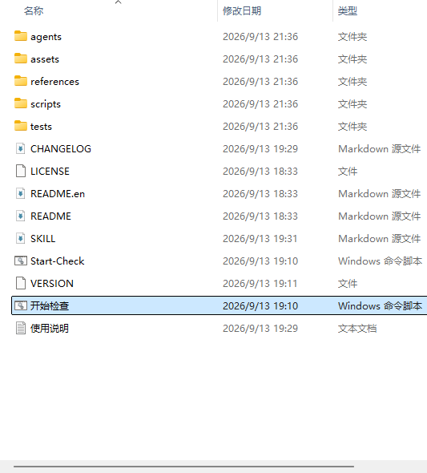
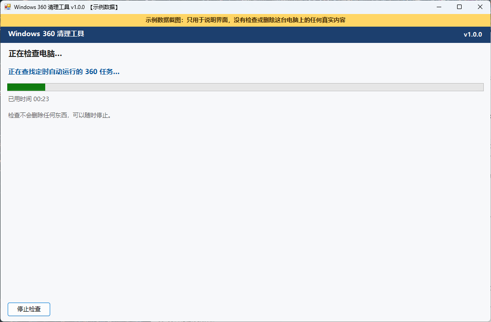
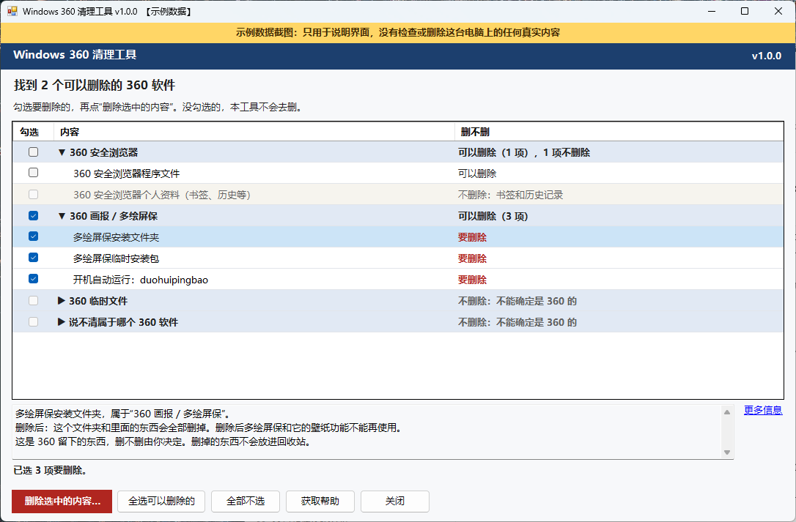
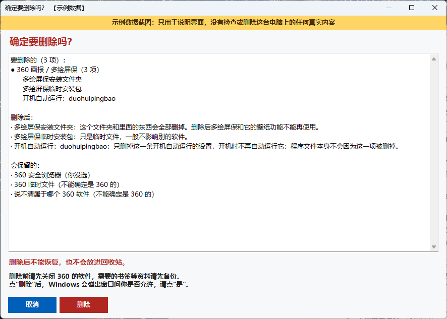
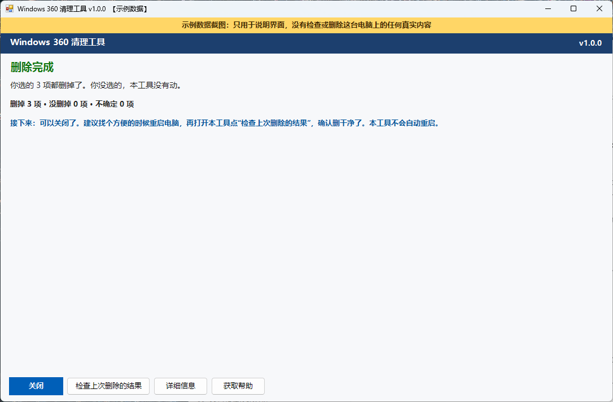
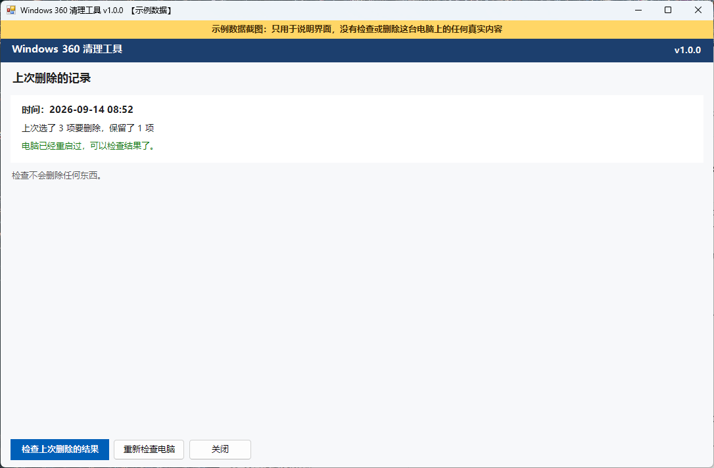
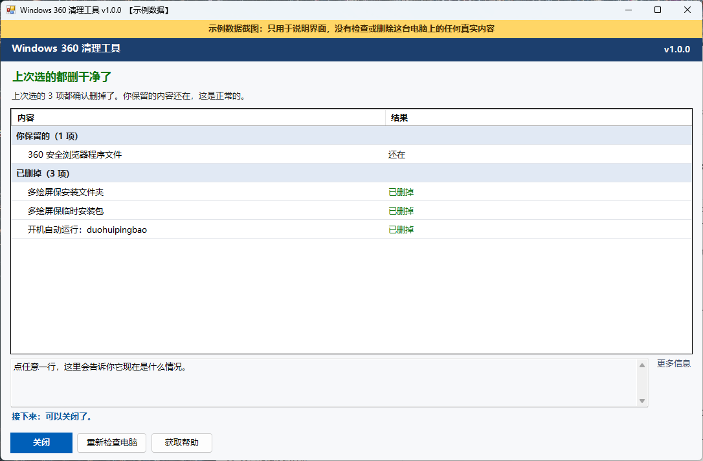

# Windows 360 清理工具新手指南

[返回首页](../README.md) · [English](getting-started.en.md) · [更新日志](../CHANGELOG.md)

这份指南一步一步带你使用 **Windows 360 清理工具 v1.0.0** 的本地窗口：先检查电脑，看每一行“删不删”，自己决定删哪些，最后手动重启电脑，再检查上次删除的结果。全程不需要懂 PowerShell、GitHub、JSON 或 AI Agent，也不需要输入任何命令。

> 本指南里的截图都是**示例数据截图**：窗口截图顶部有“示例数据截图”黄色横幅，生成截图时没有检查或删除任何真实电脑上的内容。你电脑上看到的内容和数量会不一样。

## 目录

- [先选一种用法](#先选一种用法)
- [开始前先了解](#开始前先了解)
- [第 1 步：下载并全部解压](#第-1-步下载并全部解压)
- [第 2 步：双击“开始检查”](#第-2-步双击开始检查)
- [第 3 步：看懂检查结果](#第-3-步看懂检查结果)
- [第 4 步：自己决定删哪些](#第-4-步自己决定删哪些)
- [第 5 步：确认删除](#第-5-步确认删除)
- [第 6 步：看删除结果](#第-6-步看删除结果)
- [第 7 步：手动重启，再检查上次删除的结果](#第-7-步手动重启再检查上次删除的结果)
- [记录文件保存在哪里](#记录文件保存在哪里)
- [需要帮助时：获取帮助](#需要帮助时获取帮助)
- [这个工具不会做的事](#这个工具不会做的事)
- [常见问题与排查](#常见问题与排查)
- [进阶：Agent 与命令行入口](#进阶agent-与命令行入口)

## 先选一种用法

本项目首先是一个 **AI Agent 技能包**，本地窗口给 Agent 碰不到电脑、或者不用 Agent 的人用。两种用法说的话一样：每个 360 软件要么“可以删除”，要么“不删除：原因”；检查不会删除任何东西，删除一定要你亲自确认。

| 你的情况 | 怎么做 |
|---|---|
| 你的 AI Agent 能在这台电脑上运行 PowerShell（例如 Codex） | 直接对它说：“帮我检查这台电脑上的 360 软件，用大白话告诉我哪些建议删除、哪些不删除，只删除我确认的。”它会列出编号，告诉你哪些建议删除、哪些不删除；你回复编号，它先给你看确认内容，你回复“确定删除”才会删。重启后告诉它“重启好了”，它再检查一遍。这份指南的窗口步骤可以跳过，示例对话见 [首页的“用 AI Agent 使用”](../README.md#用-ai-agent-使用推荐) |
| Agent 不能运行本机命令（例如网页版豆包），或者你不用 Agent | 按下面的 7 步使用“开始检查”窗口。豆包可以帮你看懂窗口里的文字，见 [豆包与通用 Agent 使用指南](doubao.md) |

用 Agent 时也请记住：Agent 可以说“建议删除”，但只有你说出的编号才会删除；写着“不删除”的，它不会建议删，也不会想办法绕过；它不会替你重启电脑。

## 开始前先了解

**这是什么**：一个免费、开源的 AI Agent 技能包，也带一个本地窗口。它会查找电脑上的 360 系列软件，例如 360 安全卫士 / 360 杀毒、360 浏览器、360 软件管家、360 画报 / 多绘屏保、winToolBox 工具箱里的 360 程序文件，以及它们留下的开机自动运行的程序、后台服务和定时自动运行的任务。**它只删除你自己勾选并确认的内容。**

**需要什么**：

- Windows 10 或 Windows 11。
- Windows 自带的 Windows PowerShell 5.1。Windows 10/11 默认就有，不用另外安装。
- 本工具不用安装，解压后直接使用。
- 只有在你确认删除时，Windows 才会弹出窗口问你是否允许。检查不需要。
- 检查通常一两分钟；电脑较慢或文件较多时会更久。
- 要在需要检查的那台 Windows 电脑上操作。手机可以阅读这份指南，但不能运行工具；macOS 和 Linux 也不能使用。

**整个流程一共 7 步，只有第 5 步会删除东西：**

| 步骤 | 你要做什么 | 会删除东西吗 |
|---|---|---|
| 1. 下载并解压 | 下载 ZIP，右键全部解压 | 不会 |
| 2. 开始检查 | 双击“开始检查”，等检查完成 | 不会 |
| 3. 看懂结果 | 看每一行的“删不删”，点一行看下面的说明 | 不会 |
| 4. 勾选 | 只勾选你确定不要的内容 | 不会，勾选只是选择 |
| 5. 确认删除 | 看清“确定要删除吗？”窗口，点“删除”，再在 Windows 弹出的窗口里点“是” | **会**：本工具只删除你勾选的内容（勾选了 360 自带的卸载程序时，它可能把同一个软件里没勾选的部分也删掉），删除后不能恢复 |
| 6. 看结果 | 看结果页的大标题和“接下来”怎么做 | 不会 |
| 7. 重启后再检查 | 手动重启，再双击“开始检查”，点“检查上次删除的结果” | 不会 |

## 第 1 步：下载并全部解压

1. 打开 [项目主页](https://github.com/LongXL6/windows-360-cleaner)，确认网址里的所有者是 `LongXL6`、仓库名是 `windows-360-cleaner`。
2. 点击 [下载 ZIP](https://github.com/LongXL6/windows-360-cleaner/archive/refs/heads/main.zip)，也可以在项目主页点 **Code → Download ZIP**。下载公开项目不需要 GitHub 账号。维护者发布正式版本后，也可以在项目的 [Releases 页面](https://github.com/LongXL6/windows-360-cleaner/releases) 下载带版本号的 ZIP。
3. 在下载好的 ZIP 文件上点右键，选择 **全部解压缩**（有的电脑显示为“全部解压”），解压到容易找到的地方，比如桌面。
4. 打开解压出来的文件夹，找到 **开始检查**（类型显示为“Windows 命令脚本”）。旁边的 **Start-Check** 是内容完全相同的英文名副本，双击哪一个都可以。从 main 分支下载的 ZIP，有时要先再打开一层同名文件夹，例如 `windows-360-cleaner-main`。

不要在压缩包预览窗口里直接双击运行，也不要只把“开始检查”一个文件复制出来：它需要同一文件夹里的 `scripts` 文件夹。下载和解压都不会检查或删除任何东西。

*示例数据截图：解压后的文件夹。你的文件列表可能略有不同（例如从 main 分支下载的 ZIP 会多几个文件夹），只要找到“开始检查”即可。*

## 第 2 步：双击“开始检查”

双击 **开始检查**。窗口标题会显示版本号，例如 `Windows 360 清理工具 v1.0.0`。

- **打开后会自动开始检查电脑。** 检查只读取信息，不删除任何东西，也不需要 Windows 的允许。
- 窗口只显示“现在正在做哪一步”和已用时间，不显示假的百分比。
- 想停下来可以点 **停止检查**。停止后这次检查没做完，结果不能用，也没有删除任何东西；之后可以点 **重新检查电脑**。
- 如果你以前用本工具删除过，并且找到了能用的上次删除记录，打开后会先显示“上次删除的记录”页面，而不是直接检查。见 [第 7 步](#第-7-步手动重启再检查上次删除的结果)。
- 同一时间只能打开一个窗口。如果提示“本工具已经打开了。”，请先找到已经打开的那个窗口。

Windows 弹出安全警告时，先看 [常见问题与排查](#常见问题与排查)。

*示例数据截图：正在检查电脑，只显示当前这一步和已用时间；绿色的条只是在来回移动，表示还在检查，不代表完成了多少。*

## 第 3 步：看懂检查结果

检查完成后，窗口顶部有一句话，例如“找到 2 个可以删除的 360 软件”，下面写着“勾选要删除的，再点‘删除选中的内容’。没勾选的，本工具不会去删。”**打开时一个都不勾选。**

*示例数据截图：检查结果。为了演示后面的步骤，图中展开了两个软件，并勾选了“360 画报 / 多绘屏保”的 3 项；你自己打开时软件是折叠的，一个都不勾选。*

### 怎么读这个列表

- 列表只有三列：**勾选**、**内容**、**删不删**。
- 结果按软件分组，例如“360 安全浏览器”“360 画报 / 多绘屏保”。软件默认折叠，点软件名可以展开，看里面每一项。
- 点任意一行，下方的说明区会告诉你它是什么、删除后会怎样。想看位置、判断依据等技术信息，点旁边的 **更多信息**。

### “删不删”这一列是什么意思

这一列只有两种答案。**只有“可以删除”能勾选。**

| 显示 | 意思 | 能不能勾选 |
|---|---|---|
| 可以删除 | 这是 360 留下、可以删掉的东西。**窗口不替你决定，删不删由你决定。** 勾选后显示为红色的“要删除” | 可以，由你决定 |
| 不删除：不能确定是 360 的 | 名字或位置看起来像 360，但不能确定真的是 360 的。为了避免误删，不删除 | 不能 |
| 不删除：书签和历史记录 | 浏览器书签、历史记录、保存的密码等个人资料 | 不能 |
| 不删除：在另一个 Windows 系统里 | 在电脑上的另一个 Windows 系统里（例如另一块硬盘上）找到的东西 | 不能 |
| 不删除：系统驱动 | 直接删除系统驱动可能导致蓝屏或开不了机 | 不能 |
| 不删除：这是别的软件 | 例如 winToolBox 工具箱本身。整个软件不删除，里面单独的 360 部分会另外列出来 | 整体不能 |
| 不删除：信息不完整 | 没能确认这一项的详细信息，为了避免删错，先不删除 | 不能，可以过一会儿重新检查电脑 |
| 不删除：请先正常卸载 | 这个软件看起来还装在电脑上。请先在 Windows“设置 → 应用”里卸载它，再重新检查电脑 | 不能 |
| 不删除：里面有要保留的东西 | 它本身可以删，但里面还有本工具不删除的东西，删它会把那些东西一起删掉 | 不能 |
| 不删除：要和它所在的文件夹一起删 | 360 自带的卸载程序要和它所在的文件夹一起删，而那个文件夹不能删 | 不能 |

少数情况下还会看到“不删除：请重新检查”，同样不能勾选；遇到时请点 **重新检查电脑**。

### 什么都没找到时

- **没有找到 360 的内容**：电脑上没有发现本工具认识的 360 软件。可以关闭工具。
- **没有找到 360 的内容，但有些地方没检查完**：结果可能不全。可以过一会儿再检查一次；反复出现时可以点 **获取帮助**。
- 如果结果上方出现黄色提示“有些地方没检查完，结果可能不全。”，点旁边的 **看看是哪些**，可以看到没检查完的地方。已经列出来的结果是准的，但可能漏掉了一些。
- 如果找到的内容都写着“不删除”，顶部会显示“找到了一些 360 相关的内容，但都不删除”，原因写在每一行后面，直接关闭就行。

## 第 4 步：自己决定删哪些

看不懂或不想删，就什么都不勾选，直接点 **关闭**。这样不会删除任何东西。

想删除时：

1. 点某一行最左边的方框，勾选你确定不要的内容。再点一次就取消勾选。
2. 点软件前面的方框，会勾选这个软件里**可以删除、并且可以一起安全删除**的内容；再点一次就全部取消。其他软件不受影响。
3. 点 **全选可以删除的**，只会勾选写着“可以删除”的内容，写着“不删除”的永远不会被勾选。它只会为了安全少选、不会多选。文件夹里面有要保留的东西、或者 360 自带的卸载程序所在的文件夹不能删时，这一行本来就写着“不删除”，不会被选上。少数情况下点软件行时有的内容没有帮你选上（例如文件夹里面还有别的软件、你没勾选的内容），列表下方会用一句话说明。它只在你点它时才勾选，打开窗口时不会自动全选。
4. 窗口底部会显示 `已选 N 项要删除。`。一次最多删除 64 项。
5. 选错了可以点 **全部不选**，重新勾选。
6. 选好后点 **删除选中的内容…**。这一步还不会删除，工具会先检查你的勾选，再打开“确定要删除吗？”窗口。

浏览器的“程序文件”和“个人资料（书签、历史等）”是分开的两项。删除程序文件后浏览器就打不开了；个人资料不删除，不能在这里勾选。

如果你勾选了 **360 自带的卸载程序**，顶部那句话会变成橙色提醒：它可能把同一个软件里你没勾选的部分也删掉。

### 如果提示“还需要调整一下”

点 **删除选中的内容…** 后，工具会先检查勾选有没有问题。有问题时会弹出“还需要调整一下”窗口，写明问题和怎么办。**这时还没有删除任何东西。**

| 提示的问题 | 为什么 | 怎么办 |
|---|---|---|
| 勾选超过 64 项 | 一次最多删除 64 项 | 点 **返回修改**，先取消一部分，例如一次只删一个软件；删完后点 **重新检查电脑**，再删下一批 |
| 勾选了外面的文件夹，但里面还有你没勾选、可以单独删除的内容 | 删除外面的文件夹会把它们一起删掉 | 点 **把这 N 项也选上**，或点 **返回修改** 后不删外面的文件夹 |
| 勾选了 360 自带的卸载程序，却没有勾选它所在的文件夹 | 卸载程序要和它所在的文件夹一起删 | 把文件夹也勾上（出现 **把这 N 项也选上** 时点它），或点 **返回修改** 后取消勾选卸载程序 |

工具只会在你亲自点 **把这 N 项也选上** 之后才补勾，不会自己替你勾选。

## 第 5 步：确认删除

“确定要删除吗？”窗口会列出：

- **要删除的**：按软件列出要删除的内容；
- **删除后**：每一项删除后会怎样；
- **删除后不能恢复，也不会放进回收站**；
- **会保留的**：你没选的和不删除的内容；
- 请先关闭 360 的软件，需要的书签等资料请先备份；
- 点“删除”后，Windows 会弹出窗口问你是否允许。

如果你勾选了 360 自带的卸载程序（例如多绘屏保自带的卸载程序），窗口会用红字提醒：它可能会把同一个软件里你没选的部分也一起删掉。这时同一个软件里没选的部分会单独列出来，不会写成“会保留的”。

*示例数据截图：“确定要删除吗？”窗口列出要删除的 3 项、删除后会怎样，以及会保留的内容：你没选的 360 安全浏览器，和两项写着“不能确定是 360 的”内容。*

- 有任何不确定，点 **取消**。它是默认按钮，直接按回车或 Esc 也只会取消，不会删除任何东西。
- 逐项看清楚没问题，才点红色的 **删除**。
- Windows 弹出窗口问你是否允许（用户账户控制）时，确认这是你刚才的操作，再点“是”。如果点“否”，结果页会显示“没有删除任何东西”。
- 如果你的账户没有管理员权限，请联系这台电脑的管理员。

### 正在删除

- 等 Windows 允许之前，页面标题是“请在 Windows 弹出的窗口里点‘是’”；真正开始删除后才显示“正在删除…”，同时显示当前这一步和已用时间。
- 得到允许后、真正删除前，工具会再检查一遍，确认你勾选的内容没有变化；如果变了、不见了，会在删除前停下。
- **开始删除后就不能中途停止**，删除结束前窗口也不能关闭。请耐心等待，不要关机。

## 第 6 步：看删除结果

*示例数据截图：删除完成。统计数字和每一步的操作记录在“详细信息”里。*

结果页用一个大标题告诉你删掉了没有，下面一句说明，再告诉你“接下来”怎么做。失败、不确定、要重启的结果，**标题和颜色都不会像成功**。

| 大标题 | 意思 | 接下来 |
|---|---|---|
| 删除完成（绿色） | 你选的都删掉了，删完后的再次检查也确认了。你没选的，本工具没有动 | 可以关闭；建议方便时保存工作并手动重启，再点“检查上次删除的结果” |
| 删除完成（橙色） | 你选的都删掉了，但运行过 360 自带的卸载程序，或者有你没选的内容删完后没法确认还在不在，页面会写明 | 同上；你没选的内容如果还需要，重启后检查一下 |
| 还差一步：请重启电脑 | 有些东西正在使用，要重启电脑后才能删掉 | 保存工作、手动重启，再点“检查上次删除的结果” |
| 有些没删掉 | 有些内容没删掉，原因列在下面（相同原因的会合成一行） | 先重启电脑，再点“检查上次删除的结果”；还是不行就点“获取帮助”。不要反复强删 |
| 不确定有没有删干净 | 没有拿到可信的删除结果，或者删除后没能再检查一遍 | **不要当作已经删干净。** 重启后再检查 |
| 没有删除任何东西 | 例如你在 Windows 弹出的窗口里点了“否” | 可以重新检查电脑，或者直接关闭 |

- `删掉 N 项 · 没删掉 N 项 · 不确定 N 项` 这一行只在“删除完成”和“有些没删掉”时显示，不会出现在“不确定”“要重启”的结果下面。
- **详细信息** 窗口里有统计（删掉的文件、文件夹、后台服务、定时任务、360 留下的设置等）、没删掉或没做完的每一项、每一步的操作记录，以及 **打开记录所在文件夹**。
- **文件逻辑大小** 是被删除文件本身的大小，**不等于**磁盘实际多出来的可用空间。有些地方没法统计时，数字是最少值。

结果页底部的按钮（按结果不同，顺序和数量会不一样）：

| 按钮 | 做什么 |
|---|---|
| 关闭 | 关闭窗口 |
| 检查上次删除的结果 | 马上检查一次，不会删除任何东西。要重启才能删完的内容，建议重启后再检查 |
| 详细信息 | 查看统计、没删掉的内容和每一步的操作记录 |
| 获取帮助 | 生成一份尽量隐藏了个人信息的问题信息，见 [需要帮助时](#需要帮助时获取帮助) |
| 重新检查电脑 | 没有删除任何东西，或者没拿到删除结果时出现（这时没有“检查上次删除的结果”和“详细信息”），重新检查一遍电脑 |

## 第 7 步：手动重启，再检查上次删除的结果

本工具**不会自动重启电脑**。

1. 保存正在编辑的文档，关闭其他程序，然后自己重启电脑。
2. 重启后，回到解压出来的文件夹，再双击 **开始检查**。
3. 找到上次删除的记录时，会显示“上次删除的记录”页面：时间、上次选了几项要删除、保留了几项，以及之后电脑有没有重启过。
4. 点 **检查上次删除的结果**。

*示例数据截图：重启后再次打开。“电脑已经重启过，可以检查结果了。”表示可以开始检查。*

| 按钮 | 做什么 |
|---|---|
| 检查上次删除的结果 | 逐项确认上次选的内容删掉了没有，推荐先用这个。检查不会删除任何东西 |
| 重新检查电脑 | 重新检查一遍，看看电脑上现在还有什么，之后可以重新决定 |
| 关闭 | 关闭窗口 |

如果页面写着“电脑还没有重启”，建议先保存工作并手动重启，再检查结果。

如果重新打开时没有出现“上次删除的记录”页面（例如上次没有生成能用的记录），工具会直接重新检查电脑，你可以看看现在还有什么。如果上次是在 AI Agent 对话里删除的，窗口首页不会显示它，请回到 Agent 那里说“帮我检查上次删除的结果”；这时如果首页出现了“上次删除的记录”，那是更早一次在窗口里的删除，请看上面的时间。

*示例数据截图：多绘屏保的 3 项在“已删掉”里；“360 安全浏览器程序文件”在“你保留的”里，状态是“还在”，这是正常的，不算删除失败。*

### 检查结果顶部可能是

| 大标题 | 意思 | 接下来 |
|---|---|---|
| 上次选的都删干净了 | 上次选的都确认删掉了（有保留的内容不见了时标题是橙色，说明里会写） | 可以关闭本工具 |
| 上次选的都删干净了，但有些地方没检查完 | 删掉了，但这次有些地方没检查完 | 过一会儿再检查一次 |
| 上次选的都删干净了，但又找到 N 项新的 360 内容 | 上次选的都删了，但这次又找到了新的 | 点“重新检查电脑”，再决定删不删 |
| 还有 N 项没删掉 | 上次选的内容里，有的还在或者有变化 | 重启电脑后打开本工具再检查；还是删不掉就点“获取帮助” |
| 有 N 项没法确认有没有删掉 / 上次选的看起来都删掉了，但这次检查没做完整 | 检查没能确认结果，不能当作已经删干净 | 重启电脑后打开本工具再检查；还是不行就点“获取帮助” |
| 上次删除的记录用不了，已经重新检查了一遍电脑 | 例如上次的记录找不到、读不出来、版本不兼容、是 1.0.0 之前的版本生成的，或者是另一个 Windows 用户删除的，所以没法逐项确认；页面显示的是重新检查电脑的结果 | 点“重新检查电脑”，看看现在还有什么 |

没有上次删除的记录、直接检查整台电脑时（例如运行 `scripts\Verify-360.cmd`），顶部可能是“没有找到还需要处理的 360 内容”“电脑上还有 N 项 360 的内容”“没有找到还需要处理的 360 内容，但有些地方没检查完”，或者“没有找到可以删除的 360 内容，但还有 N 项不删除的内容”（例如还装着、要先正常卸载的软件）。这时列表分为 **现在还有的 360 内容**、**没法确认或没检查完** 和 **不删除的**，不会把它们标成“新找到的”。

检查不需要 Windows 的允许。如果当初是用管理员身份检查和删除的，普通权限下看不到的定时任务、后台服务或读不到的程序，会放在“没法确认或没检查完”里，不会被当作已经删掉。

### 检查列表分成几组

列表只显示有内容的分组，按下面的顺序：

- **没删掉**：上次选了，但它还在。如果是文件正在使用，保存工作、手动重启后再检查。
- **没法确认或没检查完**：检查时读不到、没法确认，不要当作已经删掉。
- **新找到的或有变化的**：这次新找到的 360 内容，或者同一位置的内容和上次不一样了。
- **你保留的，但不见了**：上次没选、现在却不见了的内容（例如被 360 自带的卸载程序一起删了）。还需要的话请重新安装。
- **你保留的**：上次没选、现在还在的内容。它们还在是正常的，**不算删除失败**。
- **已删掉**：直接查看过、确认已经不在的内容。

**检查只读取信息，不会删除任何东西。** 想处理新找到的或还在的内容，点 **重新检查电脑**，在新的结果里重新决定、重新勾选、重新确认。上次的确认不会用到新内容上。

## 记录文件保存在哪里

你不需要打开这些记录文件。工具会把它们保存在**桌面**上；桌面不可用时，保存在临时文件夹 `%TEMP%`。在“详细信息”或“获取帮助”窗口里点 **打开记录所在文件夹** 就能找到。

| 文件名 | 是什么 |
|---|---|
| `360-cleanup-scan-日期-时间-编号.json` | 检查电脑的记录 |
| `360-cleanup-remove-日期-时间-编号.json` | 删除的记录 |
| `360-cleanup-verify-日期-时间-编号.json` | 检查上次删除结果的记录 |
| `360-cleanup-task-日期-时间-编号.json` | 删除任务记录。只用来在重启后找到对应的记录、检查上次删除的结果，**不能用来删除任何东西** |
| `360-cleanup-help-日期-时间-编号.txt` | 你在“获取帮助”里保存的问题信息 |

- 新记录不会覆盖旧文件，本工具也不会上传记录。
- 记录里有工具版本（`ToolVersion`）。旧版本生成的记录仍然可以读取。1.0.0 之前的版本没有记录你勾选了哪些内容，所以旧的删除不能逐项检查，但检查整台电脑仍然可以用。
- 不要手动修改记录。如果检查结果在你勾选期间被改动，工具会停下并要求重新检查电脑，不会删除任何东西。
- 记录里有电脑上的文件路径等信息，**不要把原始记录文件公开发给别人**。如果你的桌面由 OneDrive 等同步软件管理，这些记录也会像桌面上的其他文件一样被同步。

## 需要帮助时：获取帮助

检查结果页、删除结果页、检查上次删除结果的页面和出错页面的底部都有 **获取帮助** 按钮。

1. 点 **获取帮助**。工具会在本机另外生成一份问题信息，包括工具版本、Windows 版本、进行到哪一步、结果和相关内容。用户名、计算机名、SID、邮箱和私人路径等会尽量隐藏，但可能有遗漏。
2. **逐行检查**预览内容。预览可以直接修改，删掉你不想让别人看到的信息。
3. 点 **复制**，或点 **保存成文件**（保存在记录所在的文件夹，文件名类似 `360-cleanup-help-日期-时间-编号.txt`）。
4. 想在 GitHub 求助时，点 **打开求助网页**。它只会用浏览器打开固定的求助页面，本工具不会发送任何内容；提交 Issue 需要登录 GitHub。填写窗口标题里的版本号（例如 v1.0.0）和卡在哪一步，再粘贴你检查过的文字。

请注意：

- 自动隐藏不能保证万无一失，发送前一定自己再检查一遍。
- 原始记录保留在你的电脑上，不会被修改。
- 问题信息只用于讨论，**不能用来删除任何东西**，也不能当作删除批准。
- 公开 Issue 所有人都能看到。不要上传原始记录文件、密码、浏览器资料或与问题无关的私人文件。

也可以通过 [首页的作者联系方式](../README.md#联系作者) 求助。

## 这个工具不会做的事

- 打开时不会帮你勾选任何内容，也不会替你决定删什么。
- 不会按“名字里有 360”去搜索删除；普通照片、游戏、全景视频或文件夹不会因为名字含 360 被当成目标。
- 不会删除浏览器书签、历史记录等个人资料；它们显示为“不删除：书签和历史记录”，不能在这里勾选。
- 不会删除写着“不删除”的内容，例如“不能确定是 360 的”“系统驱动”“在另一个 Windows 系统里”。
- 不会自动重启电脑，不会开机自启，不会常驻后台，不会上传任何内容。
- 不会把没删掉、跳过、没做完或没法确认的内容说成已经删掉。
- 它不是杀毒软件，也不能保证找到所有历史或未来版本的 360 软件。

## 常见问题与排查

| 遇到的情况 | 怎么办 |
|---|---|
| 双击“开始检查”没反应，或弹出“没有找到 scripts 文件夹中的程序文件” | 通常是没有全部解压，或者只复制了“开始检查”一个文件。回到 ZIP，右键选择 **全部解压缩**，在解压出来的文件夹里双击“开始检查” |
| 弹出“Windows PowerShell 没能正常运行清理工具……” | 可能被系统策略或安全软件阻止，也可能是文件损坏。不要为了运行本工具关闭安全防护；运行 `scripts\Scan-360.cmd` 查看具体错误，或截图求助；公司或学校电脑请联系管理员。如果弹出时正在删除，就不确定有没有删干净：重启电脑后再双击“开始检查”，点“检查上次删除的结果” |
| 手机、macOS 或 Linux 上打不开 | 本工具只能在 Windows 10/11 电脑上运行。请把 ZIP 下载到要检查的那台 Windows 电脑上 |
| Windows 弹出安全警告（例如“无法验证发布者”“Windows 已保护你的电脑”），或提示被组织策略阻止 | 这是因为脚本没有数字签名，或者电脑有安全策略。先确认 ZIP 是从本项目主页下载的，不确定就不要运行。**不要为了运行本工具关闭杀毒软件、SmartScreen 或修改系统策略**；公司或学校的电脑请联系管理员 |
| 提示“本工具已经打开了。” | 同一时间只能打开一个窗口。找到已经打开的窗口继续使用，或先把它关闭 |
| 点了 **停止检查**，显示“检查已停止” | 检查没有做完，结果不能用，没有删除任何东西。点 **重新检查电脑** 即可 |
| 显示“有些地方没检查完，结果可能不全。” | 已经列出来的结果是准的，但可能漏掉了一些。点 **看看是哪些**，过一会儿再检查一次。不要为此关闭安全软件或修改权限 |
| 勾选超过 64 项 | 一次最多删除 64 项。分批删除：先删一个软件，删完并重新检查电脑后，再删下一批 |
| 提示“还需要调整一下”，说文件夹里面还有没勾选的内容 | 点 **把这 N 项也选上**，或点 **返回修改** 后不删外面的文件夹。详见 [第 4 步](#第-4-步自己决定删哪些) |
| 在 Windows 弹出的窗口里点了“否”，显示“没有删除任何东西” | 确实没有删除任何东西。想继续时重新检查电脑，再勾选并确认；没有管理员权限时请联系电脑管理员 |
| 删除结果显示“不确定有没有删干净” | 不要当作已经删干净。保存工作、手动重启，再双击“开始检查”，点“检查上次删除的结果”；如果没有出现“上次删除的记录”页面，就看重新检查电脑的结果还有什么 |
| 检查显示“有 N 项没法确认有没有删掉” | 保存工作后手动重启，再检查一次；还是没法确认时，点 **获取帮助** |
| 删除时想关闭窗口，但关不掉 | 删除进行中不能关闭窗口，以免删到一半、说不清删了什么。请等删除结束 |
| 找不到记录文件 | 在“详细信息”或“获取帮助”窗口里点 **打开记录所在文件夹**。默认在桌面；桌面不可用时在临时文件夹 `%TEMP%` |
| 提示“检查结果被改动了” | 检查结果在你勾选时被改动了。没有删除任何东西，请重新检查电脑 |
| 360 或多绘屏保过一段时间又出现 | 重新检查电脑，看看有没有新的开机自动运行的程序、定时自动运行的任务或后台服务；需要时点 **获取帮助**。进阶说明见 [疑难排查（英文）](troubleshooting.md) |
| 用 Agent 删除后，Agent 说“完成了”，但我不确定它真的做了 | Agent 没有给你看检查结果、删除前也没有给你看确认内容，就不要当作已经检查或删除过。可以改用“开始检查”窗口重新检查电脑 |
| 还是不明白 | 点 **获取帮助**，检查过里面的文字后 [提交求助 Issue](https://github.com/LongXL6/windows-360-cleaner/issues/new?template=help.yml)（需要登录 GitHub） |

## 进阶：Agent 与命令行入口

不用 Agent 的话，用“开始检查”就够了。下面的内容给熟悉 AI Agent 或命令行的人参考：

- 让 AI Agent 使用本项目时，先让它读 [SKILL.md](../SKILL.md)。它会运行检查，再用 `scripts\Show-360Summary.ps1` 把结果变成和窗口一样的大白话；删除命令也由这个脚本按你说出的编号生成，Agent 要等你明确回复“确定删除”才运行。豆包等不能安装技能的 Agent，见 [豆包与通用 Agent 使用指南](doubao.md)。普通聊天机器人未必能操作你的电脑；Agent 说“完成了”却拿不出命令结果或记录，就不能当作已经执行。
- `scripts\Scan-360.cmd` 和 `scripts\Verify-360.cmd` 打开的是同一个窗口，分别直接进入“检查电脑”和“检查上次删除的结果”，同时保留一个命令行窗口显示输出，适合排查窗口打不开的问题。
- `scripts\Remove-360.cmd` 是“整份已审阅报告”的高级入口，会处理报告中全部仍然确认（`Confirmed`）的目标，不适合只想删其中几项的新手。
- Agent 或命令行要检查某一次删除时，使用 `scripts\Invoke-360Cleanup.ps1 -Mode Verify -PreviousRemoveReport <Remove 报告路径>`。参数、退出码和字段说明见 [SKILL.md](../SKILL.md)。
- 拒绝访问、屏保反复出现、多个 Windows 系统等进阶问题，见 [troubleshooting.md](troubleshooting.md)（英文）。
